# 🚀 MLOps 自動化全套教學 - 完整實戰指南

## 📖 教學目標

通過本教學，您將學會：
- 建立端到端的 MLOps 流水線
- 實現模型自動訓練、驗證、部署
- 設置監控和自動化 CI/CD
- 掌握生產級機器學習系統架構

## 🎯 學習路徑

```mermaid
graph LR
    A[環境設置] --> B[模型開發]
    B --> C[實驗管理]
    C --> D[自動訓練]
    D --> E[模型驗證]
    E --> F[服務部署]
    F --> G[監控運維]
    G --> H[持續優化]
```



---

# 第一章：環境設置與基礎配置

## 🛠️ 1.1 開發環境準備

### 步驟 1：一鍵設置專案 (推薦)
```bash
# 複製專案
git clone <your-repo>
cd mlops-template

# 一鍵執行完整設置 (包含所有修復)
bash scripts/quickstart.sh

# 或者只安裝依賴
bash scripts/quickstart.sh --install-only
```

### 步驟 2：手動設置 (如需自定義)
```bash
# 檢查 Poetry 是否安裝
poetry --version

# 使用專門的 Poetry 設置腳本
bash scripts/setup/setup_poetry.sh

# 或手動安裝依賴
make install    # 推薦：完整安裝
make install-dev  # 或：最小化安裝 (僅開發工具)

# 驗證 GPU 設置
make checkgpu
```

### 步驟 3：開發容器設置 (可選)
```bash
# VS Code 用戶
# 1. 打開 Command Palette (Ctrl+Shift+P)
# 2. 選擇 "Dev Containers: Reopen in Container"
# 3. 等待容器構建完成

# 驗證環境
poetry shell
python --version
nvidia-smi
```

### 步驟 3：項目結構理解
```
mlops-template/
├── domain/              # 領域層：核心業務邏輯
│   ├── data/           # 資料管理
│   ├── models/         # 模型開發
│   └── experiments/    # 實驗記錄
├── application/         # 應用層：業務應用
│   ├── training/       # 訓練流水線
│   ├── inference/      # 推論服務
│   └── validation/     # 模型驗證
├── infrastructure/     # 基礎設施層
│   ├── deployment/     # 部署配置
│   ├── monitoring/     # 監控設置
│   └── cicd/          # CI/CD 配置
└── shared/            # 共享工具與配置
```

---

# 第二章：模型開發與實驗管理

## 🔬 2.1 建立您的第一個 ML 實驗

### 實戰練習：Iris 分類模型

#### 步驟 1：數據準備
```bash
# 進入實驗目錄
cd domain/experiments/notebooks

# 啟動 Jupyter Lab
poetry run jupyter lab
```

在 Jupyter 中創建新的 notebook：`iris_experiment.ipynb`

```python
# 數據準備和探索性分析
import pandas as pd
import numpy as np
from sklearn.datasets import load_iris
from sklearn.model_selection import train_test_split
from sklearn.ensemble import RandomForestClassifier
from sklearn.metrics import accuracy_score, classification_report
import matplotlib.pyplot as plt
import seaborn as sns

# 載入數據
iris = load_iris()
X, y = iris.data, iris.target

# 創建 DataFrame
df = pd.DataFrame(X, columns=iris.feature_names)
df['target'] = y
df['target_name'] = df['target'].map({i: name for i, name in enumerate(iris.target_names)})

# 數據探索
print("數據集概覽:")
print(df.head())
print(f"數據形狀: {df.shape}")

# 可視化
plt.figure(figsize=(12, 8))
sns.pairplot(df, hue='target_name')
plt.title("Iris Dataset Pairplot")
plt.show()
```

#### 步驟 2：模型訓練和評估
```python
# 分割數據
X_train, X_test, y_train, y_test = train_test_split(
    X, y, test_size=0.2, random_state=42, stratify=y
)

# 訓練模型
models = {
    'RandomForest': RandomForestClassifier(n_estimators=100, random_state=42),
    'LogisticRegression': LogisticRegression(random_state=42),
    'SVC': SVC(random_state=42)
}

results = {}
for name, model in models.items():
    # 訓練
    model.fit(X_train, y_train)

    # 預測
    y_pred = model.predict(X_test)

    # 評估
    accuracy = accuracy_score(y_test, y_pred)
    results[name] = {
        'model': model,
        'accuracy': accuracy,
        'predictions': y_pred
    }

    print(f"{name} 準確率: {accuracy:.4f}")
    print(f"{name} 分類報告:")
    print(classification_report(y_test, y_pred, target_names=iris.target_names))
    print("-" * 50)
```

### 步驟 3：實驗記錄和版本管理
```python
import mlflow
import mlflow.sklearn
from datetime import datetime

# 設置 MLflow
mlflow.set_experiment("iris_classification")

# 記錄最佳模型
best_model_name = max(results.keys(), key=lambda x: results[x]['accuracy'])
best_model = results[best_model_name]['model']
best_accuracy = results[best_model_name]['accuracy']

with mlflow.start_run(run_name=f"iris_{best_model_name}_{datetime.now().strftime('%Y%m%d_%H%M')}"):
    # 記錄參數
    mlflow.log_param("model_type", best_model_name)
    mlflow.log_param("test_size", 0.2)
    mlflow.log_param("random_state", 42)

    # 記錄指標
    mlflow.log_metric("accuracy", best_accuracy)

    # 記錄模型
    mlflow.sklearn.log_model(
        sk_model=best_model,
        artifact_path="model",
        registered_model_name="iris_classifier"
    )

    print(f"模型 {best_model_name} 已記錄，準確率: {best_accuracy:.4f}")
```

## 🎯 2.2 建立可重複的訓練流水線

### 創建結構化的訓練腳本

創建 `application/training/pipelines/iris_training_pipeline.py`：

```python
import os
import sys
import argparse
import json
from pathlib import Path
from datetime import datetime
import joblib

# 添加專案根目錄到路徑
project_root = Path(__file__).parent.parent.parent.parent
sys.path.append(str(project_root))

import mlflow
import mlflow.sklearn
from sklearn.datasets import load_iris
from sklearn.model_selection import train_test_split
from sklearn.ensemble import RandomForestClassifier
from sklearn.metrics import accuracy_score, classification_report, confusion_matrix
import numpy as np

class IrisTrainingPipeline:
    """Iris 分類模型訓練流水線"""

    def __init__(self, config_path=None):
        self.config = self.load_config(config_path)
        self.setup_mlflow()

    def load_config(self, config_path):
        """載入訓練配置"""
        default_config = {
            "model": {
                "n_estimators": 100,
                "max_depth": None,
                "random_state": 42
            },
            "data": {
                "test_size": 0.2,
                "random_state": 42
            },
            "experiment_name": "iris_classification_pipeline"
        }

        if config_path and Path(config_path).exists():
            with open(config_path, 'r') as f:
                config = json.load(f)
            # 合併配置
            for key in default_config:
                if key not in config:
                    config[key] = default_config[key]
            return config

        return default_config

    def setup_mlflow(self):
        """設置 MLflow"""
        mlflow.set_experiment(self.config["experiment_name"])

    def load_data(self):
        """載入和準備數據"""
        print("📊 載入數據...")
        iris = load_iris()
        X, y = iris.data, iris.target

        X_train, X_test, y_train, y_test = train_test_split(
            X, y,
            test_size=self.config["data"]["test_size"],
            random_state=self.config["data"]["random_state"],
            stratify=y
        )

        print(f"訓練集大小: {X_train.shape}")
        print(f"測試集大小: {X_test.shape}")

        return X_train, X_test, y_train, y_test, iris.target_names

    def train_model(self, X_train, y_train):
        """訓練模型"""
        print("🔧 訓練模型...")
        model = RandomForestClassifier(**self.config["model"])
        model.fit(X_train, y_train)
        return model

    def evaluate_model(self, model, X_test, y_test, target_names):
        """評估模型"""
        print("📈 評估模型...")
        y_pred = model.predict(X_test)

        accuracy = accuracy_score(y_test, y_pred)
        report = classification_report(y_test, y_pred, target_names=target_names, output_dict=True)
        cm = confusion_matrix(y_test, y_pred)

        return {
            'accuracy': accuracy,
            'classification_report': report,
            'confusion_matrix': cm,
            'predictions': y_pred
        }

    def save_model(self, model, metrics, model_name="iris_classifier"):
        """儲存模型和指標"""
        print("💾 儲存模型...")

        # 創建模型目錄
        model_dir = project_root / "application" / "registry" / "model_registry"
        model_dir.mkdir(parents=True, exist_ok=True)

        # 儲存模型
        model_path = model_dir / f"{model_name}_{datetime.now().strftime('%Y%m%d_%H%M%S')}.joblib"
        joblib.dump(model, model_path)

        # 儲存指標
        metrics_path = model_path.with_suffix('.json')
        with open(metrics_path, 'w') as f:
            # 將 numpy 數組轉換為列表
            serializable_metrics = {}
            for key, value in metrics.items():
                if isinstance(value, np.ndarray):
                    serializable_metrics[key] = value.tolist()
                else:
                    serializable_metrics[key] = value
            json.dump(serializable_metrics, f, indent=2)

        return str(model_path), str(metrics_path)

    def run_training(self):
        """執行完整的訓練流水線"""
        print("🚀 開始 MLOps 訓練流水線...")

        with mlflow.start_run(run_name=f"iris_pipeline_{datetime.now().strftime('%Y%m%d_%H%M')}"):
            # 載入數據
            X_train, X_test, y_train, y_test, target_names = self.load_data()

            # 記錄參數
            mlflow.log_params(self.config["model"])
            mlflow.log_params(self.config["data"])

            # 訓練模型
            model = self.train_model(X_train, y_train)

            # 評估模型
            metrics = self.evaluate_model(model, X_test, y_test, target_names)

            # 記錄指標
            mlflow.log_metric("accuracy", metrics['accuracy'])
            mlflow.log_metric("precision_macro", metrics['classification_report']['macro avg']['precision'])
            mlflow.log_metric("recall_macro", metrics['classification_report']['macro avg']['recall'])
            mlflow.log_metric("f1_macro", metrics['classification_report']['macro avg']['f1-score'])

            # 記錄模型到 MLflow
            mlflow.sklearn.log_model(
                sk_model=model,
                artifact_path="model",
                registered_model_name="iris_classifier_pipeline"
            )

            # 儲存模型到本地
            model_path, metrics_path = self.save_model(model, metrics)

            print("✅ 訓練完成！")
            print(f"📊 準確率: {metrics['accuracy']:.4f}")
            print(f"💾 模型儲存位置: {model_path}")
            print(f"📈 指標儲存位置: {metrics_path}")

            return model, metrics

def main():
    parser = argparse.ArgumentParser(description="Iris 分類模型訓練流水線")
    parser.add_argument("--config", type=str, help="訓練配置文件路徑")
    args = parser.parse_args()

    # 執行訓練流水線
    pipeline = IrisTrainingPipeline(config_path=args.config)
    model, metrics = pipeline.run_training()

    return model, metrics

if __name__ == "__main__":
    main()
```

### 創建訓練配置文件

創建 `application/training/configs/iris_config.json`：

```json
{
  "model": {
    "n_estimators": 150,
    "max_depth": 10,
    "min_samples_split": 2,
    "min_samples_leaf": 1,
    "random_state": 42
  },
  "data": {
    "test_size": 0.2,
    "random_state": 42
  },
  "experiment_name": "iris_production_pipeline",
  "model_name": "iris_rf_classifier",
  "version": "1.0.0"
}
```

---

# 第三章：模型服務化與 API 開發

## 🚀 3.1 使用 BentoML 建立推論服務

### 步驟 1：建立 BentoML 服務

創建 `application/inference/services/iris_service.py`：

```python
import numpy as np
import pandas as pd
from typing import List
import bentoml
from bentoml.io import NumpyNdarray, JSON
from pydantic import BaseModel

# 定義輸入數據模型
class IrisFeatures(BaseModel):
    sepal_length: float
    sepal_width: float
    petal_length: float
    petal_width: float

class IrisBatch(BaseModel):
    instances: List[IrisFeatures]

# 載入已訓練的模型 (使用新的 runner 模式)
iris_model_runner = bentoml.sklearn.get("iris_classifier_pipeline:latest").to_runner()

@bentoml.Service(
    name="iris_classifier",
    runners=[iris_model_runner],
)
class IrisClassifier:
    """Iris 花朵分類服務"""

    def __init__(self):
        self.class_names = ["setosa", "versicolor", "virginica"]

    @bentoml.api
    def classify(self, input_data: NumpyNdarray) -> JSON:
        """
        對 Iris 特徵進行分類

        參數:
        - input_data: numpy array of shape (n_samples, 4)
                     [sepal_length, sepal_width, petal_length, petal_width]

        返回:
        - JSON: 包含預測結果和置信度
        """
        # 確保輸入形狀正確
        if input_data.ndim == 1:
            input_data = input_data.reshape(1, -1)

        # 預測 (使用 runner 模式)
        predictions = iris_model_runner.predict.run(input_data)
        probabilities = iris_model_runner.predict_proba.run(input_data)

        results = []
        for i, (pred, prob) in enumerate(zip(predictions, probabilities)):
            result = {
                "prediction": self.class_names[pred],
                "prediction_id": int(pred),
                "confidence": float(max(prob)),
                "probabilities": {
                    self.class_names[j]: float(prob[j])
                    for j in range(len(self.class_names))
                }
            }
            results.append(result)

        return {"predictions": results}

    @bentoml.api
    def classify_json(self, input_data: JSON) -> JSON:
        """
        使用 JSON 格式進行分類

        參數:
        - input_data: JSON 格式的特徵數據

        返回:
        - JSON: 包含預測結果和置信度
        """
        try:
            # 解析輸入數據
            if "instances" in input_data:
                # 批次預測格式
                features_list = []
                for instance in input_data["instances"]:
                    features = [
                        instance["sepal_length"],
                        instance["sepal_width"],
                        instance["petal_length"],
                        instance["petal_width"]
                    ]
                    features_list.append(features)
                input_array = np.array(features_list)
            else:
                # 單個預測格式
                features = [
                    input_data["sepal_length"],
                    input_data["sepal_width"],
                    input_data["petal_length"],
                    input_data["petal_width"]
                ]
                input_array = np.array([features])

            # 調用分類方法
            return self.classify(input_array)

        except KeyError as e:
            return {"error": f"Missing required field: {str(e)}"}
        except Exception as e:
            return {"error": f"Prediction error: {str(e)}"}

    @bentoml.api
    def health_check(self) -> JSON:
        """健康檢查端點"""
        return {
            "status": "healthy",
            "model_name": "iris_classifier",
            "version": "1.0.0",
            "classes": self.class_names
        }
```

### 步驟 2：建立 BentoML 配置文件

創建 `application/inference/services/bentofile.yaml`：

```yaml
service: "iris_service:IrisClassifier"
labels:
  owner: mlops-team
  project: iris-classification
  environment: production
include:
  - "iris_service.py"
exclude:
  - "tests/"
  - "*.pyc"
python:
  packages:
    - scikit-learn
    - pandas
    - numpy
    - pydantic
docker:
  distro: debian
  python_version: "3.9"
  cuda_version: null
```

### 步驟 3：測試服務

創建測試腳本 `application/inference/services/test_service.py`：

```python
import requests
import json
import numpy as np

def test_numpy_endpoint():
    """測試 numpy 端點"""
    print("🧪 測試 NumPy 端點...")

    # 測試數據 (Iris Setosa)
    test_data = np.array([[5.1, 3.5, 1.4, 0.2]])

    response = requests.post(
        "http://localhost:3000/classify",
        headers={"Content-Type": "application/json"},
        json=test_data.tolist()
    )

    if response.status_code == 200:
        result = response.json()
        print("✅ NumPy 端點測試成功")
        print(f"預測結果: {result}")
    else:
        print(f"❌ NumPy 端點測試失敗: {response.status_code}")
        print(response.text)

def test_json_endpoint():
    """測試 JSON 端點"""
    print("\n🧪 測試 JSON 端點...")

    # 單個預測
    test_data = {
        "sepal_length": 5.1,
        "sepal_width": 3.5,
        "petal_length": 1.4,
        "petal_width": 0.2
    }

    response = requests.post(
        "http://localhost:3000/classify_json",
        headers={"Content-Type": "application/json"},
        json=test_data
    )

    if response.status_code == 200:
        result = response.json()
        print("✅ JSON 端點測試成功")
        print(f"預測結果: {result}")
    else:
        print(f"❌ JSON 端點測試失敗: {response.status_code}")
        print(response.text)

def test_batch_endpoint():
    """測試批次預測端點"""
    print("\n🧪 測試批次預測端點...")

    # 批次預測
    test_data = {
        "instances": [
            {"sepal_length": 5.1, "sepal_width": 3.5, "petal_length": 1.4, "petal_width": 0.2},
            {"sepal_length": 6.2, "sepal_width": 2.9, "petal_length": 4.3, "petal_width": 1.3},
            {"sepal_length": 7.3, "sepal_width": 2.9, "petal_length": 6.3, "petal_width": 1.8}
        ]
    }

    response = requests.post(
        "http://localhost:3000/classify_json",
        headers={"Content-Type": "application/json"},
        json=test_data
    )

    if response.status_code == 200:
        result = response.json()
        print("✅ 批次預測測試成功")
        print(f"預測結果: {json.dumps(result, indent=2, ensure_ascii=False)}")
    else:
        print(f"❌ 批次預測測試失敗: {response.status_code}")
        print(response.text)

def test_health_check():
    """測試健康檢查端點"""
    print("\n🧪 測試健康檢查端點...")

    response = requests.get("http://localhost:3000/health_check")

    if response.status_code == 200:
        result = response.json()
        print("✅ 健康檢查測試成功")
        print(f"服務狀態: {result}")
    else:
        print(f"❌ 健康檢查測試失敗: {response.status_code}")
        print(response.text)

if __name__ == "__main__":
    print("🚀 開始測試 Iris 分類服務...")
    print("請確保服務正在運行: poetry run bentoml serve iris_service.py:IrisClassifier --reload")
    print("-" * 60)

    test_health_check()
    test_numpy_endpoint()
    test_json_endpoint()
    test_batch_endpoint()

    print("\n✅ 所有測試完成！")
```

---

# 第四章：自動化 CI/CD 流水線

## ⚙️ 4.1 設置 GitHub Actions

### 步驟 1：建立 CI/CD 工作流

創建 `infrastructure/cicd/github_actions/ml_pipeline.yml`：

```yaml
name: MLOps Pipeline

on:
  push:
    branches: [ main, develop ]
    paths:
      - 'domain/models/**'
      - 'application/training/**'
      - 'application/inference/**'
  pull_request:
    branches: [ main ]
    paths:
      - 'domain/models/**'
      - 'application/training/**'
      - 'application/inference/**'
  workflow_dispatch:
    inputs:
      deploy_environment:
        description: 'Deployment Environment'
        required: true
        default: 'staging'
        type: choice
        options:
        - staging
        - production

env:
  PYTHON_VERSION: "3.9"
  POETRY_VERSION: "1.6.1"

jobs:
  code-quality:
    runs-on: ubuntu-latest
    name: Code Quality Checks

    steps:
    - name: Checkout code
      uses: actions/checkout@v4

    - name: Set up Python
      uses: actions/setup-python@v4
      with:
        python-version: ${{ env.PYTHON_VERSION }}

    - name: Install Poetry
      uses: snok/install-poetry@v1
      with:
        version: ${{ env.POETRY_VERSION }}

    - name: Cache Poetry dependencies
      uses: actions/cache@v3
      with:
        path: ~/.cache/pypoetry
        key: ${{ runner.os }}-poetry-${{ hashFiles('**/poetry.lock') }}
        restore-keys: |
          ${{ runner.os }}-poetry-

    - name: Install dependencies
      run: |
        poetry config virtualenvs.create true
        poetry config virtualenvs.in-project true
        poetry install --with dev

    - name: Code formatting check
      run: |
        poetry run black --check shared/ domain/ application/ tests/

    - name: Lint code
      run: |
        poetry run pylint --disable=R,C shared/ domain/ application/

    - name: Type checking
      run: |
        poetry run mypy shared/ domain/ application/ --ignore-missing-imports

    - name: Security scan
      run: |
        poetry run bandit -r shared/ domain/ application/ -f json -o bandit-report.json || true

    - name: Upload security scan results
      uses: actions/upload-artifact@v4
      if: always()
      with:
        name: security-scan-results
        path: bandit-report.json

  unit-tests:
    runs-on: ubuntu-latest
    name: Unit Tests
    needs: code-quality

    steps:
    - name: Checkout code
      uses: actions/checkout@v4

    - name: Set up Python
      uses: actions/setup-python@v4
      with:
        python-version: ${{ env.PYTHON_VERSION }}

    - name: Install Poetry
      uses: snok/install-poetry@v1
      with:
        version: ${{ env.POETRY_VERSION }}

    - name: Install dependencies
      run: |
        poetry install --with dev

    - name: Run unit tests
      run: |
        poetry run pytest tests/unit/ -v --cov=shared --cov=domain --cov=application \
          --cov-report=xml --cov-report=html --cov-report=term-missing

    - name: Upload coverage reports
      uses: codecov/codecov-action@v3
      with:
        file: ./coverage.xml
        flags: unittests
        name: codecov-umbrella

    - name: Upload test results
      uses: actions/upload-artifact@v4
      if: always()
      with:
        name: test-results
        path: |
          coverage.xml
          htmlcov/

  model-training:
    runs-on: ubuntu-latest
    name: Model Training & Validation
    needs: unit-tests
    if: github.event_name == 'push' || github.event.inputs.deploy_environment

    steps:
    - name: Checkout code
      uses: actions/checkout@v4

    - name: Set up Python
      uses: actions/setup-python@v4
      with:
        python-version: ${{ env.PYTHON_VERSION }}

    - name: Install Poetry
      uses: snok/install-poetry@v1
      with:
        version: ${{ env.POETRY_VERSION }}

    - name: Install dependencies
      run: |
        poetry install --with dev --extras all

    - name: Setup MLflow tracking
      run: |
        mkdir -p mlruns
        poetry run python -c "import mlflow; mlflow.create_experiment('ci_cd_pipeline')" || true

    - name: Run model training
      env:
        MLFLOW_TRACKING_URI: sqlite:///mlflow.db
      run: |
        poetry run python application/training/pipelines/iris_training_pipeline.py \
          --config application/training/configs/iris_config.json

    - name: Model validation
      run: |
        poetry run python application/validation/model_validation/validate_model.py \
          --model-path application/registry/model_registry/ \
          --threshold 0.95

    - name: Upload model artifacts
      uses: actions/upload-artifact@v4
      with:
        name: model-artifacts
        path: |
          application/registry/model_registry/
          mlflow.db
          mlruns/

  build-service:
    runs-on: ubuntu-latest
    name: Build BentoML Service
    needs: model-training
    if: github.event_name == 'push' || github.event.inputs.deploy_environment

    steps:
    - name: Checkout code
      uses: actions/checkout@v4

    - name: Download model artifacts
      uses: actions/download-artifact@v4
      with:
        name: model-artifacts
        path: ./

    - name: Set up Python
      uses: actions/setup-python@v4
      with:
        python-version: ${{ env.PYTHON_VERSION }}

    - name: Install Poetry
      uses: snok/install-poetry@v1
      with:
        version: ${{ env.POETRY_VERSION }}

    - name: Install dependencies
      run: |
        poetry install --with dev --extras all

    - name: Build BentoML service
      run: |
        cd application/inference/services
        poetry run bentoml build

    - name: Export BentoML service
      run: |
        BENTO_TAG=$(poetry run bentoml list iris_classifier --output json | jq -r '.[0].tag')
        poetry run bentoml export $BENTO_TAG ./iris_classifier_service.bento

    - name: Upload BentoML service
      uses: actions/upload-artifact@v4
      with:
        name: bento-service
        path: iris_classifier_service.bento

  integration-tests:
    runs-on: ubuntu-latest
    name: Integration Tests
    needs: build-service

    services:
      bentoml:
        image: bentoml/bentoml:latest
        ports:
          - 3000:3000

    steps:
    - name: Checkout code
      uses: actions/checkout@v4

    - name: Download BentoML service
      uses: actions/download-artifact@v4
      with:
        name: bento-service
        path: ./

    - name: Set up Python
      uses: actions/setup-python@v4
      with:
        python-version: ${{ env.PYTHON_VERSION }}

    - name: Install test dependencies
      run: |
        pip install requests pytest

    - name: Start BentoML service
      run: |
        bentoml import iris_classifier_service.bento
        BENTO_TAG=$(bentoml list iris_classifier --output json | jq -r '.[0].tag')
        bentoml serve $BENTO_TAG --port 3000 &
        sleep 30  # Wait for service to start

    - name: Run integration tests
      run: |
        python application/inference/services/test_service.py

    - name: Run load tests
      run: |
        python tests/integration/test_load_performance.py

  deploy-staging:
    runs-on: ubuntu-latest
    name: Deploy to Staging
    needs: integration-tests
    if: github.ref == 'refs/heads/develop' || github.event.inputs.deploy_environment == 'staging'
    environment: staging

    steps:
    - name: Checkout code
      uses: actions/checkout@v4

    - name: Download BentoML service
      uses: actions/download-artifact@v4
      with:
        name: bento-service
        path: ./

    - name: Deploy to staging
      run: |
        echo "🚀 部署到 Staging 環境"
        # 這裡添加您的部署腳本
        # 例如：部署到 AWS ECS, GKE, 或其他平台

    - name: Run smoke tests
      run: |
        echo "🧪 執行冒煙測試"
        # 添加部署後的驗證測試

  deploy-production:
    runs-on: ubuntu-latest
    name: Deploy to Production
    needs: integration-tests
    if: github.ref == 'refs/heads/main' || github.event.inputs.deploy_environment == 'production'
    environment: production

    steps:
    - name: Checkout code
      uses: actions/checkout@v4

    - name: Download BentoML service
      uses: actions/download-artifact@v4
      with:
        name: bento-service
        path: ./

    - name: Deploy to production
      run: |
        echo "🚀 部署到 Production 環境"
        # 這裡添加您的生產部署腳本

    - name: Run production smoke tests
      run: |
        echo "🧪 執行生產環境冒煙測試"
        # 添加生產環境驗證測試

    - name: Notify deployment
      run: |
        echo "📢 通知部署完成"
        # 添加通知邏輯（Slack, Email, 等）
```

---

# 第五章：模型監控與維運

## 📊 5.1 建立模型監控系統

### 步驟 1：創建監控指標收集

創建 `infrastructure/monitoring/metrics/model_metrics.py`：

```python
import time
import json
import logging
from datetime import datetime
from typing import Dict, List, Any
from prometheus_client import Counter, Histogram, Gauge, start_http_server
import numpy as np
from sklearn.metrics import accuracy_score, precision_recall_fscore_support

# 設置日誌
logging.basicConfig(level=logging.INFO)
logger = logging.getLogger(__name__)

# Prometheus 指標定義
PREDICTION_COUNTER = Counter(
    'ml_predictions_total',
    'Total number of predictions made',
    ['model_name', 'version', 'class']
)

PREDICTION_LATENCY = Histogram(
    'ml_prediction_duration_seconds',
    'Time spent processing prediction requests',
    ['model_name', 'version']
)

MODEL_ACCURACY = Gauge(
    'ml_model_accuracy',
    'Current model accuracy',
    ['model_name', 'version']
)

PREDICTION_CONFIDENCE = Histogram(
    'ml_prediction_confidence',
    'Distribution of prediction confidence scores',
    ['model_name', 'version', 'class']
)

DATA_DRIFT_SCORE = Gauge(
    'ml_data_drift_score',
    'Data drift detection score',
    ['model_name', 'feature']
)

ERROR_COUNTER = Counter(
    'ml_prediction_errors_total',
    'Total number of prediction errors',
    ['model_name', 'version', 'error_type']
)

class ModelMetricsCollector:
    """模型指標收集器"""

    def __init__(self, model_name: str, model_version: str = "1.0.0"):
        self.model_name = model_name
        self.model_version = model_version
        self.prediction_history = []
        self.ground_truth_history = []

    def record_prediction(self,
                         features: np.ndarray,
                         prediction: str,
                         confidence: float,
                         latency: float,
                         ground_truth: str = None):
        """記錄單次預測指標"""

        # 記錄預測次數
        PREDICTION_COUNTER.labels(
            model_name=self.model_name,
            version=self.model_version,
            class=prediction
        ).inc()

        # 記錄延遲
        PREDICTION_LATENCY.labels(
            model_name=self.model_name,
            version=self.model_version
        ).observe(latency)

        # 記錄置信度
        PREDICTION_CONFIDENCE.labels(
            model_name=self.model_name,
            version=self.model_version,
            class=prediction
        ).observe(confidence)

        # 保存預測歷史
        prediction_record = {
            'timestamp': datetime.now(),
            'features': features.tolist(),
            'prediction': prediction,
            'confidence': confidence,
            'latency': latency
        }

        if ground_truth:
            prediction_record['ground_truth'] = ground_truth
            self.ground_truth_history.append(ground_truth)

        self.prediction_history.append(prediction_record)

        # 如果有真實標籤，計算準確率
        if ground_truth and len(self.ground_truth_history) >= 10:
            recent_predictions = [p['prediction'] for p in self.prediction_history[-10:]]
            recent_ground_truth = self.ground_truth_history[-10:]

            if len(recent_predictions) == len(recent_ground_truth):
                accuracy = accuracy_score(recent_ground_truth, recent_predictions)
                MODEL_ACCURACY.labels(
                    model_name=self.model_name,
                    version=self.model_version
                ).set(accuracy)

        logger.info(f"預測記錄: {prediction} (置信度: {confidence:.3f}, 延遲: {latency:.3f}s)")

    def record_error(self, error_type: str, error_message: str):
        """記錄預測錯誤"""
        ERROR_COUNTER.labels(
            model_name=self.model_name,
            version=self.model_version,
            error_type=error_type
        ).inc()

        logger.error(f"預測錯誤: {error_type} - {error_message}")

    def detect_data_drift(self,
                         current_features: np.ndarray,
                         reference_features: np.ndarray,
                         feature_names: List[str]):
        """簡單的資料漂移檢測"""

        for i, feature_name in enumerate(feature_names):
            current_mean = np.mean(current_features[:, i])
            reference_mean = np.mean(reference_features[:, i])
            current_std = np.std(current_features[:, i])
            reference_std = np.std(reference_features[:, i])

            # 計算標準化差異
            mean_diff = abs(current_mean - reference_mean) / reference_std
            std_diff = abs(current_std - reference_std) / reference_std

            drift_score = max(mean_diff, std_diff)

            DATA_DRIFT_SCORE.labels(
                model_name=self.model_name,
                feature=feature_name
            ).set(drift_score)

            if drift_score > 2.0:  # 警告閾值
                logger.warning(f"資料漂移警告: {feature_name} (分數: {drift_score:.3f})")

    def get_prediction_summary(self, hours: int = 24) -> Dict[str, Any]:
        """獲取預測摘要報告"""
        cutoff_time = datetime.now() - timedelta(hours=hours)
        recent_predictions = [
            p for p in self.prediction_history
            if p['timestamp'] > cutoff_time
        ]

        if not recent_predictions:
            return {"message": "No recent predictions"}

        # 計算統計資訊
        total_predictions = len(recent_predictions)
        avg_confidence = np.mean([p['confidence'] for p in recent_predictions])
        avg_latency = np.mean([p['latency'] for p in recent_predictions])

        class_distribution = {}
        for p in recent_predictions:
            pred_class = p['prediction']
            class_distribution[pred_class] = class_distribution.get(pred_class, 0) + 1

        summary = {
            "time_period_hours": hours,
            "total_predictions": total_predictions,
            "average_confidence": float(avg_confidence),
            "average_latency_seconds": float(avg_latency),
            "class_distribution": class_distribution,
            "predictions_per_hour": total_predictions / hours
        }

        # 如果有真實標籤，計算準確率
        recent_with_truth = [p for p in recent_predictions if 'ground_truth' in p]
        if recent_with_truth:
            predictions = [p['prediction'] for p in recent_with_truth]
            ground_truths = [p['ground_truth'] for p in recent_with_truth]
            accuracy = accuracy_score(ground_truths, predictions)
            precision, recall, f1, _ = precision_recall_fscore_support(
                ground_truths, predictions, average='weighted'
            )

            summary.update({
                "accuracy": float(accuracy),
                "precision": float(precision),
                "recall": float(recall),
                "f1_score": float(f1),
                "labeled_predictions": len(recent_with_truth)
            })

        return summary

    def export_metrics(self, filepath: str):
        """導出指標到文件"""
        summary = self.get_prediction_summary()

        with open(filepath, 'w') as f:
            json.dump({
                "model_name": self.model_name,
                "model_version": self.model_version,
                "export_timestamp": datetime.now().isoformat(),
                "metrics_summary": summary,
                "recent_predictions": self.prediction_history[-100:]  # 最近100次預測
            }, f, indent=2, default=str)

        logger.info(f"指標已導出到: {filepath}")

# 啟動 Prometheus 指標服務器
def start_metrics_server(port: int = 8000):
    """啟動 Prometheus 指標伺服器"""
    start_http_server(port)
    logger.info(f"Prometheus 指標伺服器已啟動，端口: {port}")
    logger.info(f"指標端點: http://localhost:{port}/metrics")

if __name__ == "__main__":
    # 示例使用
    import time
    from datetime import timedelta

    # 啟動指標伺服器
    start_metrics_server(8000)

    # 創建指標收集器
    collector = ModelMetricsCollector("iris_classifier", "1.0.0")

    # 模擬一些預測
    for i in range(50):
        features = np.random.rand(1, 4)
        prediction = np.random.choice(['setosa', 'versicolor', 'virginica'])
        confidence = np.random.uniform(0.7, 0.99)
        latency = np.random.uniform(0.001, 0.050)

        collector.record_prediction(features, prediction, confidence, latency)
        time.sleep(0.1)

    # 生成報告
    summary = collector.get_prediction_summary(1)  # 最近1小時
    print("預測摘要:", json.dumps(summary, indent=2))

    # 導出指標
    collector.export_metrics("model_metrics_export.json")

    print("指標收集完成！訪問 http://localhost:8000/metrics 查看 Prometheus 指標")
```

### 步驟 2：整合監控到 BentoML 服務

更新 `application/inference/services/iris_service.py`：

```python
import numpy as np
import pandas as pd
import time
from typing import List
import bentoml
from bentoml.io import NumpyNdarray, JSON
from pydantic import BaseModel

# 導入監控組件
import sys
from pathlib import Path
project_root = Path(__file__).parent.parent.parent.parent
sys.path.append(str(project_root))

from infrastructure.monitoring.metrics.model_metrics import ModelMetricsCollector, start_metrics_server

# 定義輸入數據模型
class IrisFeatures(BaseModel):
    sepal_length: float
    sepal_width: float
    petal_length: float
    petal_width: float

class IrisBatch(BaseModel):
    instances: List[IrisFeatures]

# 載入已訓練的模型
iris_model_ref = bentoml.sklearn.get("iris_classifier_pipeline:latest")

@bentoml.service(
    resources={"cpu": "2"},
    traffic={"timeout": 20},
)
class IrisClassifier:
    """Iris 花朵分類服務 - 含監控功能"""

    def __init__(self):
        self.model = iris_model_ref.load_model()
        self.class_names = ["setosa", "versicolor", "virginica"]

        # 初始化監控
        self.metrics_collector = ModelMetricsCollector("iris_classifier", "1.0.0")

        # 啟動 Prometheus 指標伺服器
        try:
            start_metrics_server(8001)  # 使用不同端口避免衝突
        except Exception as e:
            print(f"指標伺服器啟動失敗: {e}")

    @bentoml.api
    def classify(self, input_data: NumpyNdarray) -> JSON:
        """對 Iris 特徵進行分類 - 含監控"""
        start_time = time.time()

        try:
            # 確保輸入形狀正確
            if input_data.ndim == 1:
                input_data = input_data.reshape(1, -1)

            # 預測
            predictions = self.model.predict(input_data)
            probabilities = self.model.predict_proba(input_data)

            # 計算處理時間
            processing_time = time.time() - start_time

            results = []
            for i, (pred, prob) in enumerate(zip(predictions, probabilities)):
                predicted_class = self.class_names[pred]
                confidence = float(max(prob))

                result = {
                    "prediction": predicted_class,
                    "prediction_id": int(pred),
                    "confidence": confidence,
                    "probabilities": {
                        self.class_names[j]: float(prob[j])
                        for j in range(len(self.class_names))
                    },
                    "processing_time_ms": processing_time * 1000
                }
                results.append(result)

                # 記錄監控指標
                self.metrics_collector.record_prediction(
                    features=input_data[i:i+1],
                    prediction=predicted_class,
                    confidence=confidence,
                    latency=processing_time
                )

            return {"predictions": results, "total_processing_time_ms": processing_time * 1000}

        except Exception as e:
            # 記錄錯誤
            self.metrics_collector.record_error("prediction_error", str(e))
            return {"error": f"Prediction error: {str(e)}"}

    @bentoml.api
    def classify_json(self, input_data: JSON) -> JSON:
        """使用 JSON 格式進行分類 - 含監控"""
        start_time = time.time()

        try:
            # 解析輸入數據
            if "instances" in input_data:
                # 批次預測格式
                features_list = []
                for instance in input_data["instances"]:
                    features = [
                        instance["sepal_length"],
                        instance["sepal_width"],
                        instance["petal_length"],
                        instance["petal_width"]
                    ]
                    features_list.append(features)
                input_array = np.array(features_list)
            else:
                # 單個預測格式
                features = [
                    input_data["sepal_length"],
                    input_data["sepal_width"],
                    input_data["petal_length"],
                    input_data["petal_width"]
                ]
                input_array = np.array([features])

            # 調用分類方法
            return self.classify(input_array)

        except KeyError as e:
            error_msg = f"Missing required field: {str(e)}"
            self.metrics_collector.record_error("input_error", error_msg)
            return {"error": error_msg}
        except Exception as e:
            error_msg = f"Prediction error: {str(e)}"
            self.metrics_collector.record_error("general_error", error_msg)
            return {"error": error_msg}

    @bentoml.api
    def health_check(self) -> JSON:
        """健康檢查端點"""
        return {
            "status": "healthy",
            "model_name": "iris_classifier",
            "version": "1.0.0",
            "classes": self.class_names,
            "metrics_endpoint": "http://localhost:8001/metrics"
        }

    @bentoml.api
    def get_metrics_summary(self, hours: int = 1) -> JSON:
        """獲取模型指標摘要"""
        try:
            summary = self.metrics_collector.get_prediction_summary(hours)
            return {"status": "success", "metrics": summary}
        except Exception as e:
            return {"status": "error", "message": str(e)}

    @bentoml.api
    def feedback(self, input_data: JSON) -> JSON:
        """接收預測反饋用於監控"""
        try:
            # 解析反饋數據
            features = np.array([[
                input_data["sepal_length"],
                input_data["sepal_width"],
                input_data["petal_length"],
                input_data["petal_width"]
            ]])

            predicted_class = input_data["predicted_class"]
            actual_class = input_data["actual_class"]
            confidence = input_data.get("confidence", 0.0)

            # 記錄帶有真實標籤的預測
            self.metrics_collector.record_prediction(
                features=features,
                prediction=predicted_class,
                confidence=confidence,
                latency=0.0,  # 反饋時不記錄延遲
                ground_truth=actual_class
            )

            return {"status": "feedback_recorded", "message": "感謝您的反饋！"}

        except KeyError as e:
            return {"status": "error", "message": f"Missing field: {str(e)}"}
        except Exception as e:
            return {"status": "error", "message": str(e)}
```

---

# 第六章：BentoML 最佳實踐與常見問題

## 🚀 6.1 BentoML 版本兼容性

### 重要：API 變化說明

BentoML 在版本更新中有重大 API 變化，以下是關鍵差異：

#### 舊版本 (不推薦)
```python
import bentoml
from bentoml.io import NumpyNdarray

# 舊的服務定義方式
@bentoml.service(
    resources={"cpu": "2"},
    traffic={"timeout": 20},
)
class MyService:
    def __init__(self):
        self.model = bentoml.sklearn.get("model:latest").load_model()
    
    @bentoml.api
    def predict(self, input_data: NumpyNdarray):
        return self.model.predict(input_data)
```

#### 新版本 (推薦)
```python
import bentoml
from bentoml.io import NumpyNdarray

# 新的服務定義方式
iris_model_runner = bentoml.sklearn.get("iris_clf:latest").to_runner()

@bentoml.Service(
    name="iris_classifier",
    runners=[iris_model_runner],
)
class MyService:
    def __init__(self):
        self.class_names = ["setosa", "versicolor", "virginica"]
    
    @bentoml.api
    def predict(self, input_data: NumpyNdarray):
        predictions = iris_model_runner.predict.run(input_data)
        probabilities = iris_model_runner.predict_proba.run(input_data)
        return {"predictions": predictions, "probabilities": probabilities}
```

### 6.2 服務啟動最佳實踐

#### 正確的啟動命令
```bash
# 方式 1: 指定檔案和服務實例 (推薦)
poetry run bentoml serve iris_service.py:svc --reload

# 方式 2: 使用 bentofile.yaml
poetry run bentoml serve . --reload

# 方式 3: 抑制警告 (生產環境)
PYTHONWARNINGS="ignore" poetry run bentoml serve iris_service.py:svc --reload
```

#### 常見啟動錯誤與解決方案

| 錯誤訊息 | 原因 | 解決方案 |
|---------|------|---------|
| `AttributeError: module 'bentoml' has no attribute 'service'` | 使用了舊的 API | 改用 `@bentoml.Service` |
| `TypeError: Service.__init__() got an unexpected keyword argument 'resources'` | 參數位置錯誤 | 將 `resources` 移到 `@bentoml.api` |
| `Attribute "IrisClassifier" not found in module` | 服務實例名稱錯誤 | 檢查服務實例名稱，通常是 `svc` |
| `UserWarning: pkg_resources is deprecated` | 第三方依賴警告 | 使用 `PYTHONWARNINGS="ignore"` |

### 6.3 模型管理最佳實踐

#### 模型註冊到 BentoML
```python
import bentoml
from sklearn.ensemble import RandomForestClassifier

# 訓練模型
model = RandomForestClassifier()
model.fit(X_train, y_train)

# 保存到 BentoML 模型庫
bento_model = bentoml.sklearn.save_model(
    "iris_clf",  # 模型名稱
    model,       # 模型物件
    signatures={
        "predict": {"batchable": True, "batch_dim": 0},
    },
    labels={
        "owner": "mlops-team",
        "stage": "dev",
        "accuracy": f"{accuracy:.4f}"
    }
)
print(f"模型已保存: {bento_model.tag}")
```

#### 模型載入和使用
```python
# 載入模型並創建 runner
model_runner = bentoml.sklearn.get("iris_clf:latest").to_runner()

# 在服務中使用
@bentoml.Service(
    name="iris_service",
    runners=[model_runner],
)
class IrisService:
    @bentoml.api
    def predict(self, input_data):
        return model_runner.predict.run(input_data)
```

### 6.4 除錯技巧

#### 檢查 BentoML 模型庫
```bash
# 列出所有模型
poetry run bentoml models list

# 查看特定模型詳情
poetry run bentoml models get iris_clf:latest

# 檢查服務狀態
poetry run bentoml services list
```

#### 測試服務
```bash
# 健康檢查
curl http://localhost:3000/health_check

# 測試預測
curl -X POST http://localhost:3000/classify \
  -H "Content-Type: application/json" \
  -d '[[5.1, 3.5, 1.4, 0.2]]'
```

---

# 第七章：Makefile 命令參考指南

## 🚀 7.1 Makefile 命令總覽

本專案提供了完整的 Makefile 來簡化開發流程。以下是所有可用命令的詳細說明：

### 環境設置命令

#### `make install` - 完整依賴安裝 (推薦)
```bash
make install
```
**功能**:
- 安裝 Poetry 所有依賴項
- 配置 PyTorch CUDA 支持
- 安裝 TensorFlow GPU 支持
- 安裝 OpenAI Whisper
**適用場景**: 完整開發環境設置

#### `make install-dev` - 最小化開發工具安裝
```bash
make install-dev
```
**功能**:
- 安裝基本開發工具 (black, pylint, pytest, jupyter)
- 跳過大型 ML 依賴項
**適用場景**: 快速設置或 CI 環境

### 開發工作流命令

#### `make refactor` - 代碼重構 (推薦)
```bash
make refactor
```
**功能**: 同時運行格式化和代碼檢查
- 等同於: `make format && make lint`
**適用場景**: 代碼提交前的品質檢查

#### `make format` - 代碼格式化
```bash
make format
```
**功能**: 使用 Black 統一代碼格式
**適用場景**: 統一代碼風格

#### `make lint` - 代碼品質檢查
```bash
make lint
```
**功能**: 使用 Pylint 檢查代碼品質
**適用場景**: 識別代碼問題和改進點

#### `make test` - 運行測試套件
```bash
make test
```
**功能**:
- 運行所有 pytest 測試
- 生成覆蓋率報告
- 測試範圍: shared/, domain/, application/
**適用場景**: 驗證代碼功能正確性

#### `make clean` - 清理構建文件
```bash
make clean
```
**功能**:
- 刪除 `__pycache__` 目錄
- 清理 `.pyc` 文件
- 移除 `dist/`, `build/`, `.coverage` 文件
**適用場景**: 清理開發環境或準備發佈

### ML 與 GPU 命令

#### `make checkgpu` - GPU 環境驗證
```bash
make checkgpu
```
**功能**:
- 驗證 PyTorch CUDA 支持
- 檢查 TensorFlow GPU 支持
- 顯示 GPU 詳細資訊
**適用場景**: GPU 配置驗證和故障排除

#### `make train` - 模型訓練
```bash
make train
```
**功能**: 運行模型訓練流水線
**適用場景**: 模型訓練和實驗

### 部署與服務命令

#### `make bento-build` - 構建 BentoML 服務
```bash
make bento-build
```
**功能**:
- 根據 `bentofile.yaml` 構建完整的 BentoML 服務包
- 打包模型、代碼、依賴和環境配置
- 生成生產就緒的服務 artifacts
**適用場景**: 生產環境準備和部署

**🔍 詳細工作流程**:

1. **讀取配置**: 解析 `bentofile.yaml` 中的服務定義
   ```yaml
   service: "iris_service:IrisClassifier"
   include:
     - "iris_service.py"
   python:
     packages:
       - scikit-learn
       - numpy
   ```

2. **模型打包**: 從 BentoML store 載入已訓練的模型
   ```python
   # 從訓練腳本保存的模型
   iris_model_runner = bentoml.sklearn.get("iris_clf:latest").to_runner()
   ```

3. **依賴分析**: 自動檢測和打包所有必要的 Python 包

4. **環境封裝**: 創建隔離的 Python 環境

5. **服務構建**: 生成包含所有組件的可執行服務包

**📦 輸出結果**:
- BentoML 服務包 (包含模型二進制文件)
- 服務元數據和配置
- Python 環境快照
- Docker 構建配置 (如果需要)

**⚠️ 前置條件**:
- 必須先運行模型訓練腳本保存模型到 BentoML store
- 需要正確的 `bentofile.yaml` 配置
- 所有依賴必須可用

#### `make containerize` - 容器化服務
```bash
make containerize
```
**功能**: 創建 Docker 容器映像
**適用場景**: 容器化部署準備

#### `make run` - 啟動本地服務 (無警告)
```bash
make run
```
**功能**:
- 啟動 BentoML 服務
- 已包含 `PYTHONWARNINGS="ignore"` 來抑制警告
- 支持 `--reload` 熱重載
**適用場景**: 本地開發和測試

#### `make deploy` - 部署服務
```bash
make deploy
```
**功能**: 部署到生產環境 (目前為佔位符)
**適用場景**: 生產環境部署

### 綜合命令

#### `make all` - 完整開發流水線
```bash
make all
```
**執行順序**: `install` → `format` → `lint` → `test` → `checkgpu`
**適用場景**: 完整環境設置和驗證

#### `make help` - 顯示幫助 (默認命令)
```bash
make help  # 或只輸入: make
```
**功能**: 顯示所有可用命令說明
**適用場景**: 查看命令幫助

## 7.2 常見使用模式

### 初次設置
```bash
# 完整環境設置
make install && make checkgpu

# 驗證設置
make all
```

### 日常開發
```bash
# 代碼改進
make refactor

# 功能測試
make test

# 清理環境
make clean
```

### 生產部署
```bash
# 構建服務
make bento-build

# 容器化
make containerize

# 本地測試
make run
```

### CI/CD 流水線
```bash
# 自動化檢查
make format && make lint && make test
```

## 7.3 故障排除

### 命令執行失敗
```bash
# 查看詳細幫助
make help

# 檢查 Poetry 環境
poetry env info

# 重新安裝依賴
make clean && make install
```

### GPU 相關問題
```bash
# 檢查 GPU 支持
make checkgpu

# 驗證 CUDA 安裝
nvidia-smi
```

### 服務啟動問題
```bash
# 檢查服務狀態
poetry run bentoml list

# 查看服務日誌
tail -f bentoml_service.log
```

---

## 🎓 總結與最佳實踐

### 完成的 MLOps 系統包含：

1. **🏗️ 系統架構** - Domain/Application/Infrastructure 分層
2. **📦 依賴管理** - Poetry 統一管理所有依賴
3. **🔬 實驗管理** - Jupyter + MLflow 實驗追蹤
4. **🚀 自動化訓練** - 可重複的訓練流水線
5. **🌐 服務部署** - BentoML 高性能推論服務
6. **⚙️ CI/CD 流水線** - GitHub Actions 自動化部署
7. **📊 監控系統** - Prometheus + 自定義指標收集
8. **🧪 測試覆蓋** - 單元測試、整合測試、負載測試

### MLOps 最佳實踐：

✅ **版本控制一切** - 代碼、數據、模型、配置
✅ **自動化流水線** - 從訓練到部署全自動化
✅ **持續監控** - 模型效能、資料漂移、系統健康
✅ **可重現性** - 確定性構建和可重複實驗
✅ **快速反饋** - 快速實驗迭代和部署回滾
✅ **安全第一** - 憑證管理和存取控制

**恭喜！您現在擁有一個完整的生產級 MLOps 系統！** 🎉

---

下一步您可以：
1. 擴展到更複雜的模型（深度學習、NLP、電腦視覺）
2. 整合雲端平台（AWS SageMaker、GCP Vertex AI）
3. 實施更高級的監控（資料漂移檢測、A/B 測試）
4. 添加更多自動化（超參數調優、AutoML）