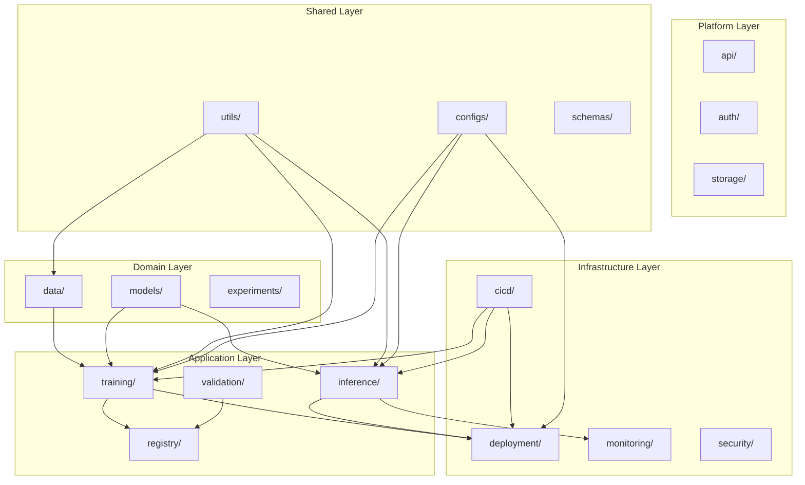

# MLOps 系統架構設計文件

## 系統設計原則

本 MLOps 系統遵循以下設計原則：
- **領域驱動設計 (DDD)**: 按業務領域組織代碼
- **分層架構**: 清晰的職責分離
- **模組化**: 高內聚低耦合
- **可擴展性**: 易於添加新功能
- **語義化命名**: 目錄名稱直接反映功能

## 系統架構層次

```
MLOps System Architecture
├── Domain Layer (領域層)
│   ├── models/          # 模型領域
│   ├── data/           # 資料領域
│   └── experiments/    # 實驗領域
├── Application Layer (應用層)
│   ├── training/       # 訓練應用
│   ├── inference/      # 推論應用
│   └── validation/     # 驗證應用
├── Infrastructure Layer (基礎設施層)
│   ├── deployment/     # 部署基礎設施
│   ├── monitoring/     # 監控基礎設施
│   └── cicd/          # CI/CD 基礎設施
└── Cross-Cutting Concerns (橫切關注點)
    ├── utils/         # 工具程式
    ├── configs/       # 配置管理
    └── docs/         # 文檔
```

## 新的資料夾結構設計

### 🏗️ 系統架構導向的資料夾結構

```
mlops-template/
├── 📁 domain/                           # 領域層 (Domain Layer)
│   ├── data/                           # 資料領域
│   │   ├── sources/                    # 資料源
│   │   │   ├── raw/                   # 原始資料
│   │   │   ├── processed/             # 處理後資料
│   │   │   └── external/              # 外部資料
│   │   ├── pipelines/                 # 資料管道
│   │   └── quality/                   # 資料品質
│   ├── models/                         # 模型領域
│   │   ├── traditional/               # 傳統機器學習
│   │   │   └── sklearn/               # scikit-learn 模型
│   │   ├── deep_learning/             # 深度學習
│   │   │   ├── pytorch/               # PyTorch 模型
│   │   │   └── tensorflow/            # TensorFlow 模型
│   │   ├── generative/                # 生成式模型
│   │   │   ├── llm/                   # 大語言模型
│   │   │   ├── vision/                # 視覺生成模型
│   │   │   └── multimodal/            # 多模態模型
│   │   └── specialized/               # 專業領域模型
│   │       ├── nlp/                   # 自然語言處理
│   │       ├── computer_vision/       # 電腦視覺
│   │       └── time_series/           # 時間序列
│   └── experiments/                    # 實驗領域
│       ├── notebooks/                 # Jupyter Notebooks
│       ├── research/                  # 研究型實驗
│       └── benchmarks/                # 基準測試
│
├── 📁 application/                      # 應用層 (Application Layer)
│   ├── training/                       # 訓練應用服務
│   │   ├── pipelines/                 # 訓練管道
│   │   ├── schedulers/                # 排程器
│   │   └── orchestration/             # 編排系統
│   ├── inference/                      # 推論應用服務
│   │   ├── services/                  # 推論服務
│   │   ├── batch/                     # 批次推論
│   │   └── streaming/                 # 流式推論
│   ├── validation/                     # 驗證應用服務
│   │   ├── model_validation/          # 模型驗證
│   │   ├── data_validation/           # 資料驗證
│   │   └── performance/               # 效能驗證
│   └── registry/                       # 註冊表服務
│       ├── model_registry/            # 模型註冊表
│       └── artifact_store/            # 製品儲存
│
├── 📁 infrastructure/                   # 基礎設施層 (Infrastructure Layer)
│   ├── deployment/                     # 部署基礎設施
│   │   ├── containers/                # 容器化
│   │   │   ├── docker/                # Docker 配置
│   │   │   └── kubernetes/            # K8s 配置
│   │   ├── cloud/                     # 雲端部署
│   │   │   ├── aws/                   # AWS 配置
│   │   │   ├── gcp/                   # GCP 配置
│   │   │   └── azure/                 # Azure 配置
│   │   └── edge/                      # 邊緣部署
│   ├── monitoring/                     # 監控基礎設施
│   │   ├── metrics/                   # 指標收集
│   │   ├── logging/                   # 日誌管理
│   │   ├── alerting/                  # 告警系統
│   │   └── dashboards/                # 監控儀表板
│   ├── cicd/                          # CI/CD 基礎設施
│   │   ├── github_actions/            # GitHub Actions
│   │   ├── jenkins/                   # Jenkins 配置
│   │   └── gitlab_ci/                 # GitLab CI
│   └── security/                       # 安全基礎設施
│       ├── secrets/                   # 密鑰管理
│       ├── access_control/            # 存取控制
│       └── compliance/                # 合規檢查
│
├── 📁 platform/                        # 平台服務層
│   ├── api/                           # API 閘道
│   ├── auth/                          # 認證授權
│   ├── storage/                       # 儲存服務
│   └── messaging/                     # 訊息傳遞
│
├── 📁 shared/                          # 共享層 (Shared/Cross-cutting)
│   ├── utils/                         # 工具程式庫
│   │   ├── common/                    # 通用工具
│   │   ├── data_utils/                # 資料處理工具
│   │   ├── model_utils/               # 模型工具
│   │   └── gpu_utils/                 # GPU 工具
│   ├── configs/                       # 配置管理
│   │   ├── environments/              # 環境配置
│   │   ├── models/                    # 模型配置
│   │   └── infrastructure/            # 基礎設施配置
│   ├── schemas/                       # 資料模式定義
│   └── constants/                     # 常數定義
│
├── 📁 tests/                           # 測試層
│   ├── unit/                          # 單元測試
│   ├── integration/                   # 整合測試
│   ├── e2e/                          # 端到端測試
│   └── performance/                   # 效能測試
│
├── 📁 docs/                            # 文檔
│   ├── architecture/                  # 架構文檔
│   ├── user_guides/                   # 使用指南
│   ├── api_reference/                 # API 參考
│   └── tutorials/                     # 教程
│
├── 📁 examples/                        # 範例與展示
│   ├── quickstart/                    # 快速開始
│   ├── tutorials/                     # 教學範例
│   └── industry_cases/                # 行業案例
│       ├── finance/                   # 金融業
│       ├── healthcare/                # 醫療業
│       └── retail/                    # 零售業
│
└── 📁 scripts/                         # 腳本工具
    ├── setup/                         # 安裝腳本
    ├── deployment/                    # 部署腳本
    └── maintenance/                   # 維護腳本
```

## 設計優勢

### 1. 語義化命名
- `domain/models/` 比 `03-models/` 更直觀
- `infrastructure/deployment/` 比 `07-deployment/` 更清晰
- 新開發者無需記憶數字編號

### 2. 符合軟體架構分層
- **Domain Layer**: 核心業務邏輯
- **Application Layer**: 應用服務
- **Infrastructure Layer**: 技術基礎設施
- **Shared Layer**: 橫切關注點

### 3. 易於擴展
- 新增模型類型：直接在 `domain/models/` 下新增
- 新增部署平台：在 `infrastructure/deployment/cloud/` 下新增
- 新增監控工具：在 `infrastructure/monitoring/` 下新增

### 4. 職責清晰
- 每個目錄都有明確的職責邊界
- 減少跨目錄的耦合
- 符合單一職責原則

## 遷移對應表

| 舊結構 (數字編號) | 新結構 (語義化) | 說明 |
|------------------|----------------|------|
| `01-data/` | `domain/data/` | 資料領域 |
| `02-experiments/` | `domain/experiments/` | 實驗領域 |
| `03-models/` | `domain/models/` | 模型領域 |
| `04-training/` | `application/training/` | 訓練應用 |
| `05-validation/` | `application/validation/` | 驗證應用 |
| `06-packaging/` | `application/inference/` | 推論應用 |
| `07-deployment/` | `infrastructure/deployment/` | 部署基礎設施 |
| `08-monitoring/` | `infrastructure/monitoring/` | 監控基礎設施 |
| `09-mlops/` | `infrastructure/cicd/` | CI/CD 基礎設施 |
| `10-utils/` | `shared/utils/` | 共享工具 |
| `11-docs/` | `docs/` | 文檔 |
| `12-tests/` | `tests/` | 測試 |

## 系統互動關係



## 開發工作流程

1. **資料準備**: `domain/data/` → 資料攝取、清理、品質檢查
2. **實驗開發**: `domain/experiments/` → 模型探索、特徵工程
3. **模型開發**: `domain/models/` → 模型實現、訓練
4. **應用服務**: `application/` → 訓練管道、推論服務
5. **基礎設施**: `infrastructure/` → 部署、監控、CI/CD
6. **平台支援**: `platform/` → API、認證、儲存

這種結構更符合現代軟體工程和 MLOps 的最佳實踐，提供了清晰的架構分層和職責分離。